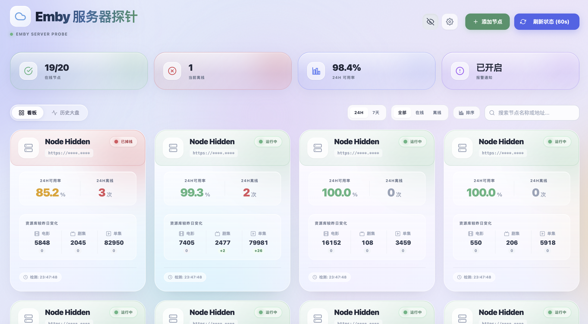

# Emby Cluster Monitor

一个部署在 Cloudflare Workers 上的 Emby 节点监控面板。它会定时探测多个 Emby 服务器的在线状态、延迟和最近 7 天历史记录，并支持 Telegram 通知、媒体库数量统计和自定义图标库。

## 交流

Telegram 交流群：[https://t.me/+mrGqjEyRCZk3YTI1](https://t.me/+mrGqjEyRCZk3YTI1)

## 预览

### 节点看板


### 历史大盘



## 功能

- 多节点在线状态监控，支持手动测速和定时测速。
- 近 7 天探测历史，节点看板支持按近 24 小时或近 7 天查看可用率。
- 历史大盘展示最近 60 次探测，便于快速查看短期波动。
- Telegram 通知，节点连续离线满 5 分钟后通知，恢复在线后通知。
- 媒体库资源统计，可记录电影、剧集、集数，并按自然日对比昨日变化。
- 第三方图标库导入，支持从 JSON 或文本中提取图片链接。
- 图标库搜索，可按图标名称或图片链接筛选。
- Cloudflare KV 持久化配置，不依赖本地浏览器存储。
- 管理 Token 保护，避免公开面板被他人修改配置。
- 版本检测和可选一键更新。配置 Cloudflare API Token 后，可在页面里直接更新到仓库最新版。

## 项目结构

```text
.
├── emby.js         # Worker 主入口，包含前端页面、API 和定时探测逻辑
└── wrangler.toml  # Cloudflare Workers 配置
```

`wrangler.toml` 只在使用 Wrangler 命令行部署，或者 Cloudflare 连接仓库自动构建时需要。按下面的控制台方式手动部署时，可以忽略这个文件。

## 部署要求

- Cloudflare Workers
- Cloudflare KV namespace
- 一个 Cloudflare 账号

## 在 Cloudflare Workers 控制台部署

直接在 Cloudflare 后台创建 Worker，选择 Helloword，并把 `emby.js` 粘贴进去，点击部署。

1. 登录 [Cloudflare Dashboard](https://dash.cloudflare.com/)。
2. 进入 **Workers & Pages**，点击 **Create**。
3. 选择 **Workers**，创建一个新的 Worker。
4. 打开刚创建的 Worker，进入 **Edit code**。
5. 删除默认示例代码，把本仓库的 `emby.js` 内容完整粘贴进去。
6. 点击 **Deploy** 保存并发布。
7. 回到 Worker 的 **Settings**，按下面的说明绑定 KV、设置环境变量和添加定时触发器。

### 创建并绑定 KV

1. 在 Cloudflare Dashboard 进入 **Storage & Databases** -> **KV**。
2. 创建一个 KV namespace： `EMBY_DB`。
3. 回到 Worker，进入 **Settings** -> **Bindings**。
4. 添加 **KV namespace binding**：

| 项目 | 值 |
| --- | --- |
| Variable name | `EMBY_DB` |
| KV namespace | 刚创建的 KV namespace |

`EMBY_DB` 用来保存节点列表、图标库、Telegram 配置和探测历史。

### 设置环境变量

在 Worker 的 **Settings** -> **Variables** 中添加环境变量。推荐至少设置 `ADMIN_TOKEN`。

| 变量 | 必填 | 说明 |
| --- | --- | --- |
| `ADMIN_TOKEN` | 推荐 | 管理密码。设置后，页面会要求输入 Token，所有配置接口都会校验。 |
| `TG_NOTIFY` | 可选 | 是否默认启用 Telegram 通知，可填 `1`、`true`、`yes` 或 `on`。 |
| `TG_BOT_TOKEN` | 可选 | Telegram Bot Token。也可以在页面里配置。 |
| `TG_CHAT_ID` | 可选 | Telegram Chat ID。也可以在页面里配置。 |

页面里保存的 Telegram 配置优先级高于环境变量。

### 可选：开启页面一键更新

默认情况下，页面只会检查 GitHub 仓库是否有新版本。要允许页面直接更新当前 Worker，需要额外设置下面这些环境变量。

| 变量 | 必填 | 说明 |
| --- | --- | --- |
| `UPDATE_ENABLED` | 是 | 填 `1` 开启一键更新。 |
| `CF_ACCOUNT_ID` | 是 | Cloudflare 账号 ID。 |
| `CF_WORKER_NAME` | 是 | 当前 Worker 的名称，例如 `emby-monitor`。 |
| `CF_API_TOKEN` | 是 | Cloudflare API Token，需要有当前账号的 Workers Scripts 编辑权限。 |
| `UPDATE_REPO_OWNER` | 可选 | 更新来源仓库 owner，默认 `pototazhang`。 |
| `UPDATE_REPO_NAME` | 可选 | 更新来源仓库名，默认 `emby-js`。 |
| `UPDATE_BRANCH` | 可选 | 更新来源分支，默认 `main`。 |
| `UPDATE_FILE` | 可选 | 更新来源文件，默认 `emby.js`。 |

强烈建议同时设置 `ADMIN_TOKEN`。更新接口会强制要求 `ADMIN_TOKEN`，未设置时不会执行一键更新。

Cloudflare API Token 建议只授予最小权限：

- Account -> Workers Scripts -> Edit
- 作用范围限制到当前账号

更新逻辑只会覆盖 Worker 脚本内容，不会清空 KV 里的节点配置、图标库和 Telegram 配置。

### 添加定时触发器

在 Worker 的 **Settings** -> **Triggers** 中添加 Cron Trigger。

默认每 5 分钟执行一次：

```toml
crons = ["*/5 * * * *"]
```

如果要改成每分钟一次：

```toml
crons = ["* * * * *"]
```

控制台里通常只需要填写 Cron 表达式本身，例如 `*/5 * * * *`。

### 绑定自定义域名

如果不想使用默认的 `workers.dev` 地址，可以给 Worker 绑定自己的域名或子域名。

1. 先确认域名已经接入 Cloudflare，并且当前账号里能看到这个域名的 zone。
2. 打开刚创建的 Worker。
3. 进入 **Domains**。如果后台没有这个标签，就进入 **Settings** -> **Domains & Routes**。
4. 点击 **Add** -> **Custom Domain**。
5. 填写要绑定的域名，例如 `emby.example.com`。
6. 点击 **Add Custom Domain**，等待 Cloudflare 自动创建 DNS 记录和证书。
7. 绑定完成后，直接访问这个域名即可打开面板。

注意：要绑定的主机名不能已经存在同名 CNAME 记录。如果之前手动添加过同名 DNS 记录，先删除旧记录，再添加 Custom Domain。

## 使用方式

1. 打开 Worker 访问地址。
2. 如果设置了 `ADMIN_TOKEN`，按提示输入 Token。
3. 点击“部署节点”，添加 Emby 地址、端口和别名。
4. 需要媒体库统计时，勾选“启用媒体库资源统计”，填写 Emby 用户名和密码。
5. 点击“立刻测速”可以手动刷新所有节点状态。
6. 在“库设置”里配置 Telegram 通知和第三方图标库。
7. 如果配置了页面一键更新，也可以在“库设置”里检查新版本并更新。

## 通知策略

通知不会在第一次波动时立刻发送：

- 第一次检测到离线：只记录离线开始时间。
- 连续离线满 5 分钟：发送一次离线通知。
- 继续离线：不重复发送。
- 恢复在线：只有此前已经发送过离线通知，才发送恢复通知。

这样可以过滤短暂网络波动，避免 Telegram 被无意义消息刷屏。

## 媒体库统计

启用媒体库资源统计后，Worker 会在每天 0 点后的第一次探测中拉取资源数量，并把当天快照和前一天快照做对比。升级到该逻辑后，已有的旧数据会自动用当前 `counts` 和旧的 `previousCounts` 生成一次“较昨日”差值，不需要手动清空配置。

## 图标库

图标库入口在页面右上角“库设置”里。输入一个可公开访问的 JSON 或文本链接后，Worker 会尝试提取里面的图片 URL。

推荐格式：

```json
{
  "server-a": "https://example.com/server-a.png",
  "server-b": "https://example.com/server-b.svg"
}
```

也支持嵌套对象、数组，或者格式不太规范但包含图片链接的文本。导入后可以点击节点图标，在视觉资产库中搜索并选择自定义图标。


## 安全说明

- 建议设置 `ADMIN_TOKEN`。
- 如果开启一键更新，必须设置 `ADMIN_TOKEN`，并妥善保管 `CF_API_TOKEN`。
- 不要把 Telegram Bot Token、Emby 用户名和密码提交到仓库。
- Worker 会拒绝访问内网地址、localhost 和常见私有网段，避免被用作内网探测代理。
