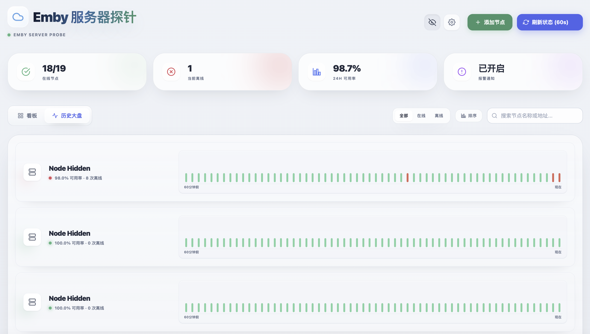

# Emby Cluster Monitor

一个部署在 Cloudflare Workers 上的 Emby 节点监控面板。它会定时探测多个 Emby 服务器的在线状态、延迟和最近 7 天历史记录，并支持 Telegram 通知、媒体库数量统计和自定义图标库。

## 交流

Telegram 交流群：[https://t.me/+mrGqjEyRCZk3YTI1](https://t.me/+mrGqjEyRCZk3YTI1)

## 预览

### 节点看板


### 历史大盘



## 功能

- 多节点在线状态监控，支持手动测速和定时测速。
- 近 7 天探测历史，节点看板支持按近 24 小时或近 7 天查看可用率。
- 历史大盘展示最近 60 次探测，便于快速查看短期波动。
- Telegram 通知，节点连续离线满 5 分钟后通知，恢复在线后通知。
- 媒体库资源统计，可记录电影、剧集、集数，并按自然日对比昨日变化。
- 第三方图标库导入，支持从 JSON 或文本中提取图片链接。
- 图标库搜索，可按图标名称或图片链接筛选。
- Cloudflare KV 持久化配置，不依赖本地浏览器存储。
- 管理 Token 保护，后台默认锁定，必须显式配置 `ADMIN_TOKEN` 才能进入和修改配置。
- 版本检测和可选一键更新。配置 Cloudflare API Token 后，可在页面里直接更新到仓库最新版。

## 项目结构

```text
.
├── src/
│   ├── app-meta.json    # 共享展示版本、Worker/Docker 更新通道版本和 updateNotes
│   ├── frontend/        # 前端 HTML/CSS/JSX 片段，构建后内联进 HTML_CONTENT
│   └── worker/          # Worker 对象方法片段，构建后拼进 export default
├── scripts/
│   ├── build.cjs        # 从 src/ 生成根目录 emby.js
│   └── verify-build.cjs # 校验生成产物、版本和关键线上协议 marker
├── emby.js              # 生成产物，部署、自更新和手动复制都使用这个文件
└── wrangler.toml        # Cloudflare Workers 配置，main 仍指向 emby.js
```

日常维护请修改 `src/`，不要直接手改根目录 `emby.js`。`wrangler.toml` 只在使用 Wrangler 命令行部署，或者 Cloudflare 连接仓库自动构建时需要。按下面的控制台方式手动部署时，可以忽略这个文件。

## 开发流程

1. 修改 `src/` 中对应职责文件。
2. 如果改动影响线上行为，先更新 `src/app-meta.json` 的 `version`、`updateChannels` 和 `updateNotes`。
3. 执行 `npm run check`，它会重新生成根目录 `emby.js` 并校验版本、更新说明、KV key、自更新 marker 和 `wrangler.toml` 入口。
4. 提交时包含 `src/`、`scripts/`、文档和生成后的根目录 `emby.js`。

`version` 是共享展示版本；页面自更新通道按 `updateChannels.worker` 和 `updateChannels.docker` 分开比较。以后如果只发布 Docker 镜像，可以只提升 `updateChannels.docker`，这样 Worker 不会误报更新；只发布 Worker 版本时同理。

普通部署、GitHub raw 自更新、一键更新和手动复制部署仍然使用根目录 `emby.js`，不需要部署 `src/` 里的拆分文件。

## 部署要求

- Cloudflare Workers
- Cloudflare KV namespace
- 一个 Cloudflare 账号

## 在 Cloudflare Workers 控制台部署

直接在 Cloudflare 后台创建 Worker，选择 Helloword，并把 `emby.js` 粘贴进去，点击部署。

1. 登录 [Cloudflare Dashboard](https://dash.cloudflare.com/)。
2. 进入 **Workers & Pages**，点击 **Create**。
3. 选择 **Workers**，创建一个新的 Worker。
4. 打开刚创建的 Worker，进入 **Edit code**。
5. 删除默认示例代码，把本仓库的 `emby.js` 内容完整粘贴进去。
6. 点击 **Deploy** 保存并发布。
7. 回到 Worker 的 **Settings**，按下面的说明绑定 KV、设置环境变量和添加定时触发器。

### 创建并绑定 KV

1. 在 Cloudflare Dashboard 进入 **Storage & Databases** -> **KV**。
2. 创建一个 KV namespace： `EMBY_DB`。
3. 回到 Worker，进入 **Settings** -> **Bindings**。
4. 添加 **KV namespace binding**：

| 项目 | 值 |
| --- | --- |
| Variable name | `EMBY_DB` |
| KV namespace | 刚创建的 KV namespace |

`EMBY_DB` 用来保存节点列表、图标库、Telegram 配置和探测历史。

### 设置环境变量

在 Worker 的 **Settings** -> **Variables** 中添加环境变量。`ADMIN_TOKEN` 必填。

| 变量 | 必填 | 说明 |
| --- | --- | --- |
| `ADMIN_TOKEN` | 必填 | 管理密码。未设置时后台会直接锁定，所有管理接口都会返回 `403`。 |
| `TG_NOTIFY` | 可选 | 是否默认启用 Telegram 通知，可填 `1`、`true`、`yes` 或 `on`。 |
| `TG_BOT_TOKEN` | 可选 | Telegram Bot Token。也可以在页面里配置。 |
| `TG_CHAT_ID` | 可选 | Telegram Chat ID。也可以在页面里配置。 |
| `PUBLIC_SHARE_WILDCARD_DOMAIN` | 可选 | 旧版分享域名配置，当前版本不再使用。 |
| `PUBLIC_SHARE_BASE_URL` | 可选 | 旧版分享域名配置，当前版本不再使用。 |

页面里保存的 Telegram 配置优先级高于环境变量。

公开分享不再依赖单独域名。页面里的“公开页”会生成当前 Worker 域名下的 `/public/<token>` 链接，单服务器“分享”会生成 `/card/<token>.svg` 链接。两者都是一次生成一个新的 token，默认有效期 1 小时，过期后旧链接失效。它们只暴露公开内容，不包含后台地址、管理 token、Emby 凭据或 KV 配置。

### 可选：开启页面一键更新

默认情况下，页面只会检查 GitHub 仓库是否有新版本。Worker 运行时只比较 Worker 通道版本，不会因为 Docker 通道发版而提示更新。要允许页面直接更新当前 Worker，需要额外设置下面这些环境变量。

| 变量 | 必填 | 说明 |
| --- | --- | --- |
| `UPDATE_ENABLED` | 是 | 填 `1` 开启一键更新。 |
| `CF_ACCOUNT_ID` | 是 | Cloudflare 账号 ID。 |
| `CF_WORKER_NAME` | 是 | 当前 Worker 的名称，例如 `emby-monitor`。 |
| `CF_API_TOKEN` | 是 | Cloudflare API Token，需要有当前账号的 Workers Scripts 编辑权限。 |
| `UPDATE_REPO_OWNER` | 可选 | 更新来源仓库 owner，默认 `pototazhang`。 |
| `UPDATE_REPO_NAME` | 可选 | 更新来源仓库名，默认 `emby-js`。 |
| `UPDATE_BRANCH` | 可选 | 更新来源分支，默认 `main`。 |
| `UPDATE_FILE` | 可选 | 更新来源文件，默认 `emby.js`。 |

强烈建议同时设置 `ADMIN_TOKEN`。更新接口会强制要求 `ADMIN_TOKEN`，未设置时不会执行一键更新。

Cloudflare API Token 建议只授予最小权限：

- Account -> Workers Scripts -> Edit
- 作用范围限制到当前账号

更新逻辑只会覆盖 Worker 脚本内容，不会清空 KV 里的节点配置、图标库和 Telegram 配置。

### 添加定时触发器

在 Worker 的 **Settings** -> **Triggers** 中添加 Cron Trigger。

推荐配置一个 Cron Trigger：

```toml
crons = ["*/1 * * * *"]
```

- `*/1 * * * *`：每分钟触发一次后台检测；定时任务只做在线状态探测，按单批 `4` 台执行，并会在同一轮 cron 内连续推进多批，直到全部跑完或接近本轮时间上限。

控制台里只需要填写 Cron 表达式本身，Cloudflare 会按这个表达式执行定时触发器。

### 绑定自定义域名

如果不想使用默认的 `workers.dev` 地址，可以给 Worker 绑定自己的域名或子域名。

1. 先确认域名已经接入 Cloudflare，并且当前账号里能看到这个域名的 zone。
2. 打开刚创建的 Worker。
3. 进入 **Domains**。如果后台没有这个标签，就进入 **Settings** -> **Domains & Routes**。
4. 点击 **Add** -> **Custom Domain**。
5. 填写要绑定的域名，例如 `emby.example.com`。
6. 点击 **Add Custom Domain**，等待 Cloudflare 自动创建 DNS 记录和证书。
7. 绑定完成后，直接访问这个域名即可打开面板。

注意：要绑定的主机名不能已经存在同名 CNAME 记录。如果之前手动添加过同名 DNS 记录，先删除旧记录，再添加 Custom Domain。

## 使用方式

1. 打开 Worker 访问地址。
2. 必须先在 Cloudflare Worker 环境变量里设置 `ADMIN_TOKEN`，否则后台会直接锁定。
3. 点击“部署节点”，添加 Emby 地址、端口和别名。
4. 需要媒体库统计时，勾选“启用媒体库资源统计”，填写 Emby 用户名和密码。
5. 点击“立刻测速”可以手动刷新所有节点状态。
6. 在“库设置”里配置 Telegram 通知和第三方图标库。
7. 点击“公开页”可以生成只读公开大盘链接。
8. 点击单个服务器的“分享”可以生成该服务器卡片的 SVG 快照链接。
9. “库设置”里的“数据迁移”支持导出/导入完整 KV 快照，方便在 Worker 版和 Docker 版之间迁移。
10. 如果配置了页面一键更新，也可以在“库设置”里检查新版本并更新。

## 通知策略

通知不会在第一次波动时立刻发送：

- 第一次检测到离线：只记录离线开始时间。
- 连续离线满 5 分钟：发送一次离线通知。
- 继续离线：不重复发送。
- 恢复在线：只有此前已经发送过离线通知，才发送恢复通知。

这样可以过滤短暂网络波动，避免 Telegram 被无意义消息刷屏。

## 媒体库统计

启用媒体库资源统计后，Worker 会在手动刷新相关服务器时更新当天资源数量快照，并把当天快照和前一天快照做对比。若某台服务器前一天没有留下有效快照，当天的“较昨日”会显示为 `0`，直到重新建立连续两天的日快照为止。旧数据会尽量沿用已有计数字段做一次兼容迁移，不需要手动清空配置。

## 图标库

图标库入口在页面右上角“库设置”里。输入一个可公开访问的 JSON 或文本链接后，Worker 会尝试提取里面的图片 URL。

推荐格式：

```json
{
  "server-a": "https://example.com/server-a.png",
  "server-b": "https://example.com/server-b.svg"
}
```

也支持嵌套对象、数组，或者格式不太规范但包含图片链接的文本。导入后可以点击节点图标，在视觉资产库中搜索并选择自定义图标。


## 安全说明

- `ADMIN_TOKEN` 必须设置。
- 如果开启一键更新，必须设置 `ADMIN_TOKEN`，并妥善保管 `CF_API_TOKEN`。
- 不要把 Telegram Bot Token、Emby 用户名和密码提交到仓库。
- Worker 会拒绝访问内网地址、localhost 和常见私有网段，避免被用作内网探测代理。

## Docker 部署

仓库同时提供了一个 Docker 常驻版运行时。它不会再使用 Cloudflare Worker cron，而是在容器里直接运行同一份根目录 `emby.js`，并用本地文件模拟 `EMBY_DB`。

### 特点

- 业务逻辑仍然来自根目录 `emby.js`，不维护第二套探针代码。
- 容器内通过 `docker/server.cjs` 适配 Worker `fetch()` 和 `scheduled()`。
- KV 数据默认持久化到宿主机 `./docker-data/kv.json`。
- 定时任务由容器内调度器执行，不再受 Cloudflare 免费版 `10ms CPU` 限制。
- 可以直接首次部署在 Docker 上，不依赖 Cloudflare Workers。
- 页面内一键更新会先启动一个临时 helper 容器，再由它替换当前业务容器，避免“更新进程把自己停掉后无法继续拉起新容器”。

### 部署方式 1：直接拉取镜像运行

这是第一次使用时最省事的方式，不需要拉源码，也不需要本地构建镜像。

1. 拉取现成镜像：

```bash
docker pull ghcr.io/pototazhang/emby-js:latest
```

2. 直接运行：

```bash
docker run -d \
  --name emby-monitor \
  -p 8787:8787 \
  -e ADMIN_TOKEN=你自己设置的后台密码 \
  -e DOCKER_SELF_UPDATE_ENABLED=1 \
  -e DOCKER_UPDATE_IMAGE=ghcr.io/pototazhang/emby-js:latest \
  -v $(pwd)/docker-data:/data \
  -v /var/run/docker.sock:/var/run/docker.sock \
  ghcr.io/pototazhang/emby-js:latest
```

3. 打开：

```text
http://<你的主机IP>:8787
```

### 部署方式 2：拉源码后用 Compose 部署

适合想查看源码、改配置、或者自己重新构建镜像的用户。

1. 拉取仓库：

```bash
git clone https://github.com/pototazhang/emby-js.git
cd emby-js
```

2. 修改 [docker-compose.yml](/Users/kunkun/emby-js/docker-compose.yml:1) 里的 `ADMIN_TOKEN`

3. 启动：

```bash
docker compose up -d --build
```

4. 打开：

```text
http://<你的主机IP>:8787
```

### 本机直接运行 Node 版

如果你想先不进 Docker，直接在本机验证这套运行时：

```bash
npm install
npm run build
npm run start:docker-local
```

默认也会把数据写到 `./docker-data/kv.json`。

### 环境变量

| 变量 | 默认值 | 说明 |
| --- | --- | --- |
| `ADMIN_TOKEN` | 无 | 必填，后台管理鉴权。 |
| `PORT` | `8787` | 容器监听端口。 |
| `HOST` | `0.0.0.0` | 容器监听地址。 |
| `DATA_DIR` | `/data` | KV 持久化目录。 |
| `SCHEDULE_ENABLED` | `1` | 是否启用定时探测。 |
| `SCHEDULE_CRON` | `*/1 * * * *` | 目前支持 `* * * * *` 或 `*/N * * * *`。 |
| `SCHEDULE_INTERVAL_MS` | 空 | 可选，直接指定毫秒间隔；设置后优先级高于 `SCHEDULE_CRON`。 |
| `RUN_SCHEDULE_ON_START` | `0` | 是否容器启动后立即跑一次定时探测。 |
| `DOCKER_SELF_UPDATE_ENABLED` | `1` | 是否启用 Docker 版一键更新。 |
| `DOCKER_UPDATE_IMAGE` | `ghcr.io/pototazhang/emby-js:latest` | 一键更新时拉取的目标镜像。 |
| `DOCKER_SOCKET_PATH` | `/var/run/docker.sock` | Docker Engine socket 路径。 |

其他业务环境变量如 `TG_BOT_TOKEN`、`TG_CHAT_ID` 仍可继续使用。纯 Docker 部署时通常不需要配置 `CF_ACCOUNT_ID`、`CF_WORKER_NAME`、`CF_API_TOKEN` 这类 Cloudflare Worker 专用变量。如果你要使用页面内的一键更新，必须额外挂载 `/var/run/docker.sock`，并保持 `DOCKER_UPDATE_IMAGE` 指向一个可拉取的新镜像。Docker 运行时只比较 Docker 通道版本，不会因为 Worker 通道发版而误报更新。

如果你当前运行的是带旧版自更新逻辑的历史镜像，那么第一次需要手动 `docker pull` 并重新 `docker run` 或 `docker compose up -d` 到包含本修复的新镜像；从这一版开始，后续页面内一键更新才会正常完成容器替换。
